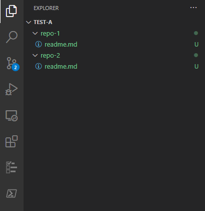
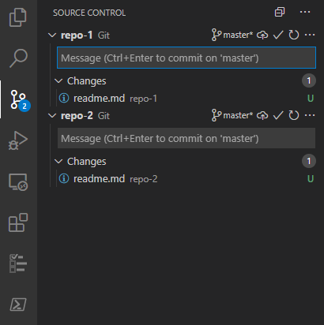
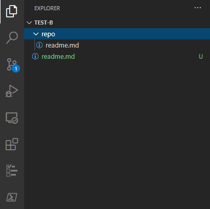
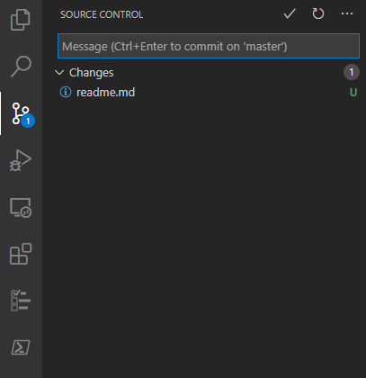

# VS Code Nested Git

VS Code supports multiples SCM providers within a single workspace:

```powershell
mkdir test-a
cd test-a
mkdir repo-1
cd repo-1
git init
echo 1 > readme.md
cd ..
mkdir repo-2
cd repo-2
git init
echo 2 > readme.md
cd ..
code .
```




However, it doesn't support the repository directories being nested.

```powershell
mkdir test-b
cd test-b
git init
echo outer > readme.md
mkdir repo
cd repo
git init
echo inner > readme.md
cd ..
code .
```





I'd like to make a case for both being useful and make a plea for the VS Code team to add support for this.
Or perhaps there is already an API that could support this and allow me to develop an extension for this.

## Workspaces

VS Code supports workspace files, by creating a workspace, where the root repository directory is the first
workspace directory and the nested repository directories follow in the flat list of workspace directories,
I figured there was a chance these would then also register in the SCM pane in VS Code, since they would be
faux-top-level. Alas, that is not the case.

## To-Do

### Study the VS Code extension API to see if this could be enabled without the VS Code team

### Fall back onto the VS Code GitHub issues to request this feature to be added if it cannot be done using an extension
